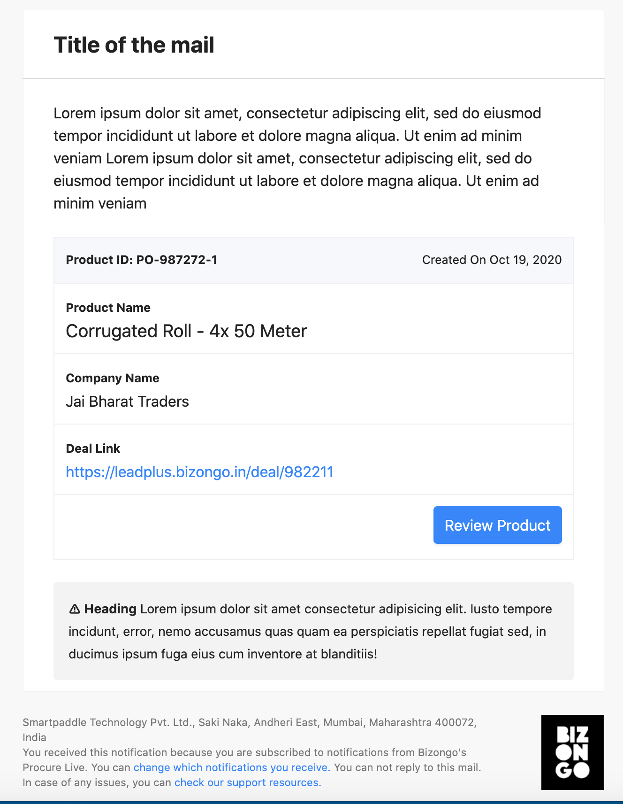
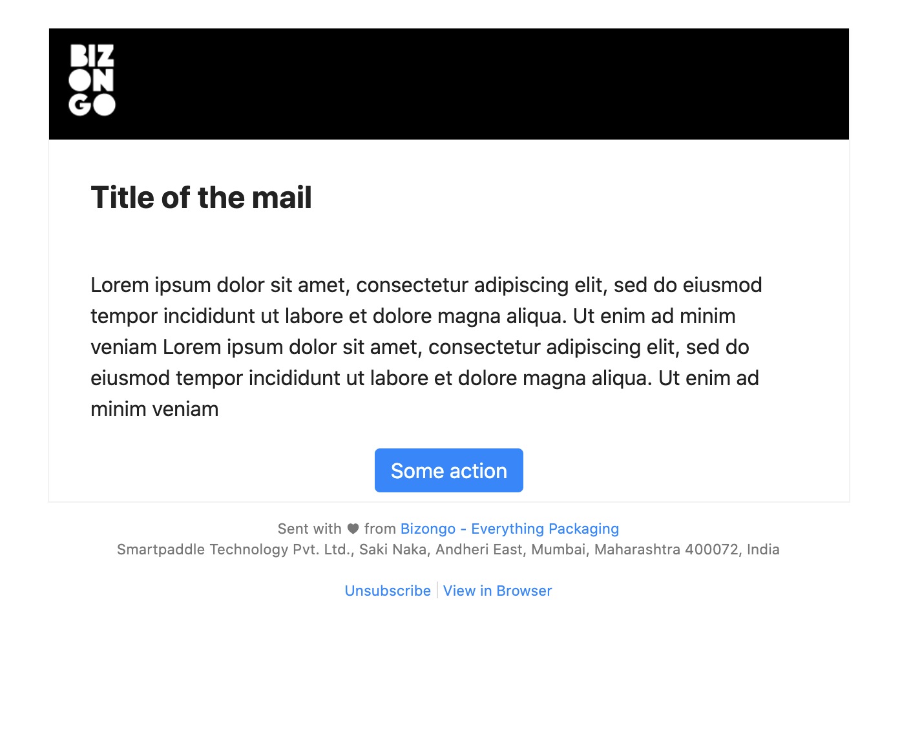

# Mailadin
A utility that allows to generate rich HTML based mail templates for transactional and marketing needs, based on preexisting partials. By using this generator, you would no longer need to handcraft your way using raw HTML, neither would you have to spend time designing inconsistent templates using a WYSIWYG editor. Best used for teams that need consistency in mail templates, but are finding it hard to achieve because of rapid distributed development.

### Setup
- Install the package by using `npm i -g mailadin`
- Open shell of choice, `mkdir test && cd _`
- Write `mailadin`
- Open the output file generated in the browser, copy it into where you needed the template and modify the content

### Generating templates
To generate template, `cd` into any folder where you want to output the files and run `mailadin`

### Components
There are 6 components available out of the box, they are:

| Component | Variant                 |  Description |   |
|-----------|-------------------------|--------------|---|
| Text      | Block | Block of text | |
| Text      | With Left Image | Block of text with an image floated to the left | |
| Text      | With Top Image | Block of text with an image floated to the top of the text | |
| Text      | Warning | Block of text highlighted specifically for communication of pre-formatted text and error / warning messages | |
| Table      | Horizontal | Table with a header row and body | |
| Table      | Vertical | Table with a single column with header row and body | |

#### Options
- `template` - Use this option to switch between marketing and transactional header and footer style, by default the generator uses the transactional template. Allowed values are `transactional` (default) & `marketing`
- `body` - Use this option to add content between the generated header and footer
- `path` - Where to output the files to, defaults to cwd


| Key | Styles         | Supported in  |
|-----|----------------|---------------|
| text |`text:block` (default), `text:image_left, text:warning, text:image_top`| `transactional` & `marketing` |
| table | `table:vertical, table:horizontal` | `transactional` & `marketing` |
| button | `button:center` (default), `button:left, button:right` | `transactional` & `marketing` |


#### CLI Usage Samples
- To generate a mail template with a block text and warning text block, you would write: `mailadin --template=transactional --body=text:block,text:warning`

```
Usage: -t <template type>

Options:
  --help          Show help                                            [boolean]
  --version       Show version number                                  [boolean]
  -t, --template  Which template to use, one of marketing or transactional
                                                             [string] [required]
  -b, --body      Comma separated values from this list: text(:block|:warning|:i
                  mage_left|:image_top),button(:left|:center|:right),table
                  (:vertical|:horizontal).                              [string]
  -p, --path      Absolute path where the files have to be generated, default is
                  current working directory                             [string]

```

### Examples
#### Transactional mail with text, table and warning


#### Marketing mail with text and button


### Contributing
To contribute to this project, please contact the author [@abbasdawood](https://github.com/abbasdawood).
Changelog is maintained [here](CHANGELOG.md)
